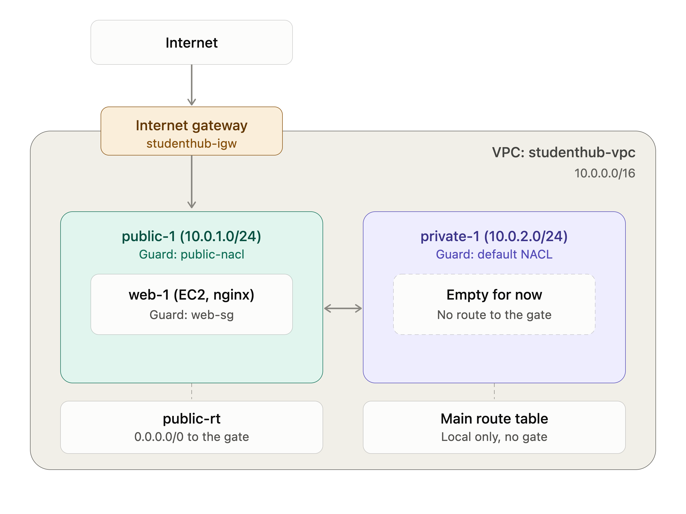

# Phase 1: Network (VPC, SG, NACL)

Overview

Created the foundational AWS networking infrastructure for the StudentHub project using Amazon Virtual Private Cloud (VPC). This phase establishes network isolation and prepares the environment for future EC2 deployments and application hosting.

Components Configured
VPC (studenthub-vpc): Created an isolated virtual network for project resources.
Public Subnet (public-1): Configured to support resources requiring direct internet connectivity.
Private Subnet (private-1): Reserved for resources that should not be directly accessible from the internet.
Internet Gateway (studenthub-igw): Created and attached to the VPC to enable internet connectivity for public subnet resources.
Public Route Table (public-rt): Configured a default route (0.0.0.0/0) pointing to the Internet Gateway.
Subnet Association: Associated the public subnet with the public route table while keeping the private subnet separate.
Architecture and Networking Concepts

This phase demonstrates the fundamentals of AWS networking, including VPC isolation, public and private subnet design, Internet Gateway configuration, route management , and subnet associations

## Screenshots

**VPC and subnets**

**Internet access**

**Security**

