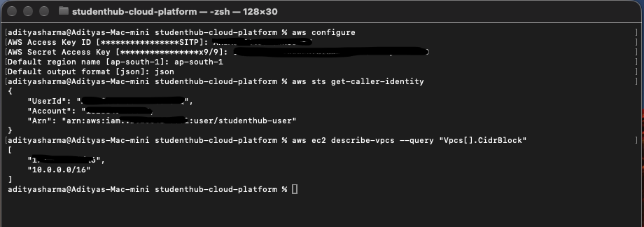

# Phase 2: Access (IAM, CLI)

## What I built
- IAM user 'studenthub-use', used for all daily work instead of the root account
- AWS CLI configured for region 'ap-south-1'
- Checked the setup with 'aws sts get-caller-identity'

## Screenshot

## What I learned
- IAM is global, but the CLI needs a region to know where to find resources.
- Access keys are long-term passwords for programs. They stay outside the repo.
- A user's name doesn't give permissions. The attached policy does.
